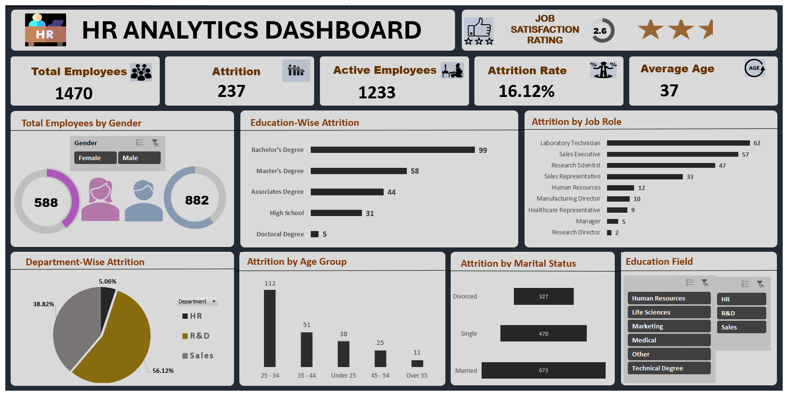

# HR Analytics Dashboard

This project showcases an interactive **HR Analytics Dashboard** created in Excel. The dashboard provides a comprehensive overview of HR metrics, including employee demographics, attrition analysis, job satisfaction ratings, education levels.... It serves as a valuable tool for data-driven decision-making in human resource management.

---

## Table of Contents
1. [Overview](#overview)
2. [Raw Data](#raw-data)
3. [Dashboard & Dashboard Features](#dashboard-features)
4. [Data Cleaning Process](Data--cleaning--process&preprocessing)
5. [Key Metrics](#key-metrics)
6. [Insights & Conclusions](#insights--conclusions)
7. [Tools & Techniques Used](#tools--techniques-used)
8. [How to Use the Dashboard](#how-to-use-the-dashboard)
9. [Questions & Answers](#questions--answers)
10. [Conclusions]
11. [Author](#author)

---

## Overview
The **HR Analytics Dashboard** is designed to analyze and visualize key HR data. It provides detailed information on workforce composition, attrition, and employee satisfaction. 

The project involved cleaning, transforming, and visualizing the data to create actionable insights for human resource management.

---

## Raw Data
The raw data for this dashboard includes a comprehensive dataset of employee details from a fictional company. It consists of the following fields:

1. **Employee ID**: Unique identifier for each employee.
2. **Gender**: Male or Female.
3. **Age**: Employee age.
4. **Department**: The department the employee belongs to (e.g., HR, R&D, Sales).
5. **Job Role**: The specific role of the employee within the department.
6. **Education**:
   - Education Level (e.g., Bachelor's Degree, Master's Degree).
   - Education Field (e.g., Human Resources, Technical, Marketing).
7. **Marital Status**: Single, Married, or Divorced.
8. **Attrition**: Indicates if the employee left the company (Yes/No).
9. **Job Satisfaction**: Rating on a scale from 1 to 5.
10. **Performance Rating**: Employee's performance evaluation score.
11. **Years at Company**: Duration of employment in years.

---
## The HR_Analytics.xls 
The file not only contains the raw data but also includes the additional sheets created during the analysis process. These sheets consist of:

**Pivot Tables**: Used for summarizing and analyzing the raw data.

**Detail Sheet**: Contains a detailed breakdown of the data and calculations.

**KPI Sheet**: Highlights key performance indicators used in the dashboard.

**Rating, Gender, Education by Attrition**: Specific analysis of employee ratings, gender distribution, and education levels in relation to attrition.

**Attrition by Job**: Insights into employee turnover across different job roles.

**Dept-wise Attrition**: Attrition analysis across departments.

**Attrition by Age Group**: Breakdown of attrition rates by age categories.

**Attrition by Marital Status**: Analysis of attrition trends based on marital status.

**HR-Data Sheet**: Contains the organized and cleaned version of the raw data, ready for analysis.

These additional sheets played a crucial role in building the dashboard and offer deeper insights for anyone interested in the data preparation and analysis process.

---

### Data Cleaning Process
- **Missing Values**: Handled missing values by applying logical assumptions or excluding irrelevant fields.
- **Data Transformation**: Converted categorical data into a format suitable for analysis using pivot tables.
- **Formatting**: Standardized date formats, names, and numeric fields for consistency.

### Data Cleaning and Preprocessing

Although the raw data contained many other fields, those unrelated to this analysis were excluded for clarity and focus. A thorough cleaning and preprocessing process was applied to the dataset to ensure:

**Relevance**: Only the fields contributing to actionable insights were retained.

**Accuracy**: Missing values and inconsistencies were handled effectively.

**Structure**: Data was transformed to suit pivot table analysis and visual representation.

---

## Dashboard Features
- **Interactive Slicers**: Users can filter data by department, education field, and job roles for dynamic analysis.
- **Visualization**: The dashboard uses pie charts, bar graphs,Funnel, and key performance indicators (KPIs) for intuitive data representation.
- **Custom Styling**: Slicer backgrounds, chart colors, and fonts were customized to enhance readability and aesthetics.

---

## Key Metrics
1. **Total Employees**: 1,470
2. **Active Employees**: 1,233
3. **Attrition**: 237 employees
4. **Attrition Rate**: 16.12%
5. **Average Age**: 37 years
6. **Job Satisfaction Rating**: 2.6 stars (out of 5)
7. **Attrition by Demographics**:
   - **Gender**: 58 males, 882 females
   - **Education Level**:
     - Bachelor's Degree: 99
     - Master's Degree: 58
     - Associate's Degree: 44
     - High School: 31
     - Doctoral Degree: 5
   - **Age Group**:
     - 25-34 years: 112
     - 35-44 years: 51
     - Under 25: 38
     - 45-54 years: 25
     - Over 55 years: 11
   - **Marital Status**:
     - Single: 470
     - Married: 473
     - Divorced: 327
8. **Department-Wise Attrition**:
   - HR: 38.82%
   - R&D: 56.12%
   - Sales: 5.06%
9. **Attrition by Job Role**: The highest attrition is in Sales Executive roles.
10. **Education Field**: Insights are segmented by different educational disciplines.

---

## Insights & Conclusions
1. **Attrition Trends**:
   - Employees with Bachelor's degrees face the highest attrition (99 employees).
   - Job roles like "Sales Executive" are particularly prone to attrition.

2. **Demographics**:
   - The majority of employees are female (882 out of 1,470).
   - Most employees fall within the 25-34 age group, indicating a younger workforce.

3. **Department Analysis**:
   - The HR department has the lowest attrition rate.
   - R&D experiences moderate attrition, while Sales has the highest attrition rate.

4. **Job Satisfaction**:
   - With a 2.6-star rating, there is significant room for improvement in employee satisfaction.

5. **Marital Status**:
   - Single employees show the highest attrition (470 employees), followed by married ones (473).

6. **Education Field**:
   - Employees from technical and marketing backgrounds exhibit varying attrition rates.

---

## Tools & Techniques Used
1. **Microsoft Excel**:
   - **Pivot Tables** for data summarization.
   - **Charts** for visual representation of insights.
   - **Slicers** for interactive filtering.
2. **Microsoft Powerpoint**: for creating visual dashboard
3. **Formatting & Styling**:
   - Custom slicer styles and chart designs.
   - Adjustments to align and group dashboard elements for a professional layout.
4. **Data Editing**:
   - Cleaned and structured raw HR data to ensure accuracy.
5. **Paint**: For dashboard screenshot edit.

---

## How to Use the Dashboard
1. **Filter Data**:
   - Use slicers on the right to filter data by department, job roles, or education field.
2. **Analyze Metrics**:
   - View key statistics and graphs to identify patterns and trends.
3. **Draw Insights**:
   - Utilize visualizations to make informed HR decisions.

---

## Questions & Answers
### Q1: What type of data was used to create this dashboard?
**A**: The dashboard is based on raw HR data containing employee demographics, job roles, education, and attrition details.

### Q2: How can I filter data by department?
**Ans**: Click on the department slicer and select the desired department(s). The dashboard will automatically update.

### Q3: What does the attrition rate indicate?
**Ans**: The attrition rate (16.12%) shows the percentage of employees who left the company out of the total workforce.

### Q4: How was the average age calculated?
**Ans**: The average age was calculated using a simple arithmetic mean formula in Excel.

### Q5: Can I update the dashboard with new data?
**Ans**: Yes, replace the data in the source table and refresh all pivot tables to update the dashboard.

---

## Author
This project was created by [Bakare Sukurat Aderonke], a data analyst with expertise in creating Insightful dashboards and performing data analysis using tools like Excel, SQL,Python and Power-BI. I am passionate about uncovering trends and delivering actionable insights accross various domains. For more information, feel free to connect with me on LinkedIn. [www.linkedin.com/in/aderonkebakare101].

---

## Conclusion
The HR Analytics Dashboard provides actionable insights into workforce composition, attrition, and job satisfaction. It serves as an effective tool for HR professionals to identify trends and implement strategies for workforce management.

